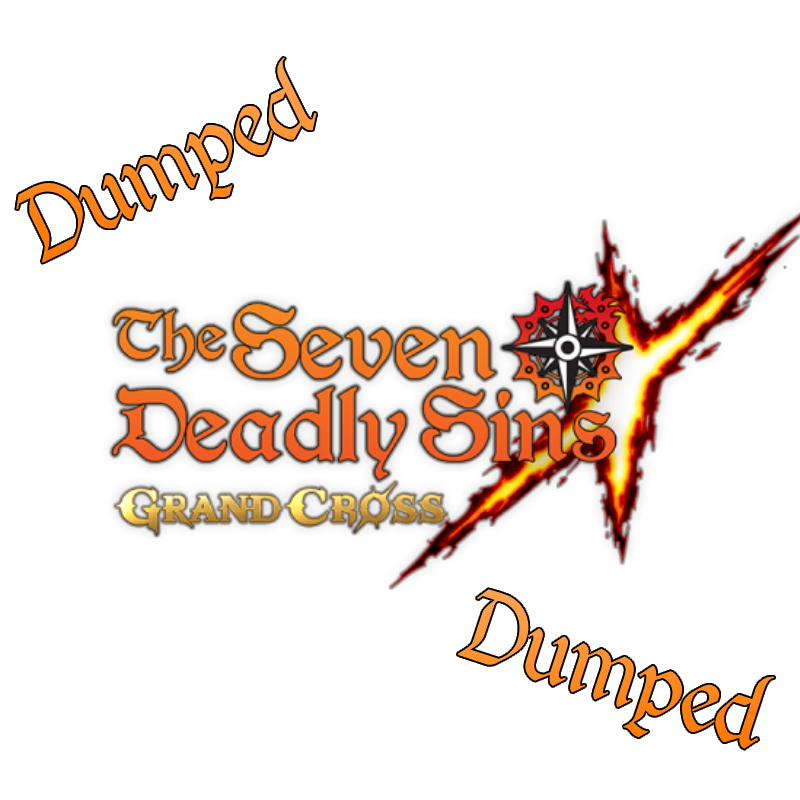

# 7DSGC Offsets

Welcome to 7DSGC Offsets. We provide PC and Android offsets generated using the Curiosity Dumper. This tool allows us to dump the game, locate all offsets, and reconstruct them into a `.hpp` file.

> Note: The Curiosity Dumper is currently in **beta**, so features and output may change.
> 
**Game:** The Seven Deadly Sins: Grand Cross  
**Version:** 2.101.1.x

---

## Contents
- Live Offsets
- Fields
- Methods
- Arguments
- Data Types
- Properties
- Structs
- Classes

## Signatures
PC client signatures will be provided.  
If you'd like to contribute Android signatures, feel free to do so.

Maintaining both PC and Android signatures simultaneously is time-consuming (each update may require multiple signatures per platform), so the focus will remain on PC for now.

*(Coming soon)*

---

## Disclaimer
This repository is strictly for educational purposes. It does not provide or promote any form of runtime manipulation, cheating, or unauthorized modification of software.
